# Create Pull Request

Creates a draft PR using the repo's PR template with auto-generated content for review.

## Workflow

```dot
digraph create_pr {
    rankdir=TB;
    node [shape=box];

    gather [label="1. Gather context\n(branch, diff, commits, PR template)"];
    jira [label="2. Ask for Jira ticket ID"];
    body [label="3. Fill in PR template\n→ show for approval"];
    create [label="4. Create draft PR"];

    gather -> jira -> body -> create;
}
```



## Steps

### 1. Gather Context

```bash
# Get branch and base
BRANCH=$(git branch --show-current)
BASE="master"  # or main

# Get diff and commits
git diff origin/$BASE...HEAD
git log origin/$BASE..HEAD --oneline
```

**Read the repo's PR template** at `.github/PULL_REQUEST_TEMPLATE.md`. It defines the exact sections and structure for the PR body. Use it as-is; do not add, remove, or reorder sections.

### 2. Prompt for Jira Ticket

Ask user: "What is the Jira ticket ID? (e.g., PLAT-123)"

Format URL: `https://tulipmfg.atlassian.net/browse/{TICKET_ID}`

### 3. Fill in PR Template

Using the repo's PR template as the exact structure, fill in every section by analyzing the diff and commits:

- **Summary**: What changed, why, key details
- **Test Plan**: Manual testing steps with checkboxes, features to verify, edge cases
- **Security-related sections**: Scan the diff for security-sensitive patterns (auth, secrets, permissions, API changes, DB changes, input handling) and fill in accordingly
- **All other template sections**: Fill in based on the diff context (e.g., level of impact, checklists, impact analysis)

If the template has checkboxes or options to select (e.g., level of impact), select the appropriate one(s).

**Show the complete filled-in PR body to the user for approval/editing before proceeding.**

If no PR template is found, use a minimal structure: Summary, Jira Task, Test Plan.

### 4. Create Draft PR

Use `gh pr create --draft` with the approved body. Always pass the body via HEREDOC.

**Always use `--draft` flag.**

## PR Title

Generate concise title (under 70 chars) from:

1. Categorization of the change (e.g., chore, feat, bugfix, docs)
1. Jira ticket prefix if provided: `[PLAT-123]`
2. Brief description of change

Show to user for approval.

## Common Mistakes

- Forgetting to read the repo's PR template
- Adding/removing/reordering sections that differ from the template
- Forgetting `--draft` flag
- Not showing generated content for approval before creating
- Missing Jira URL formatting
- Creating PR before user approves all sections
